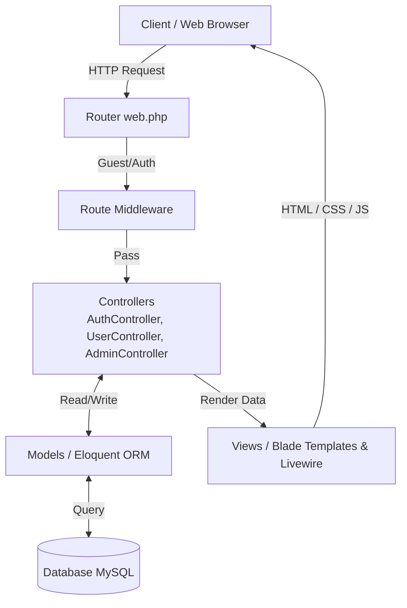
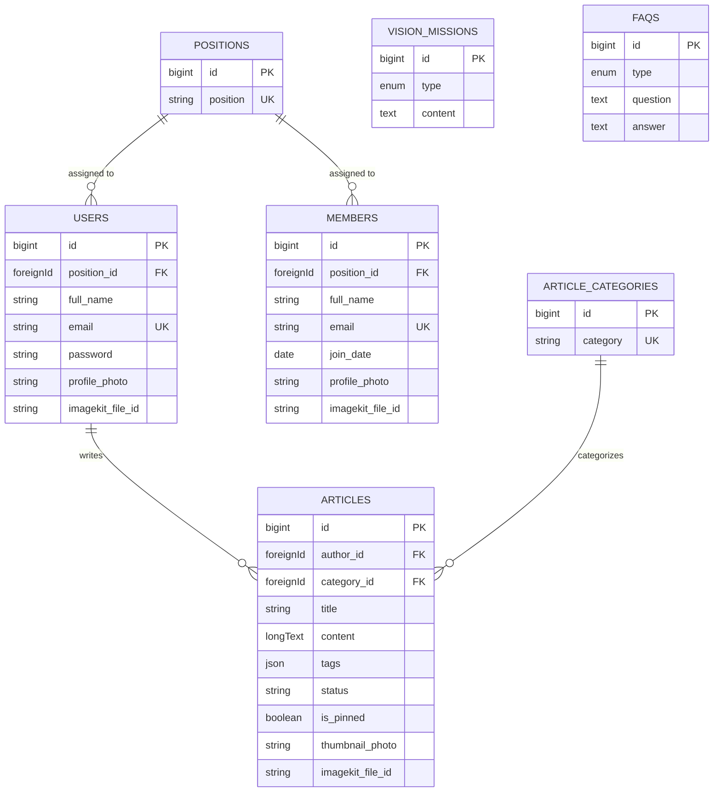
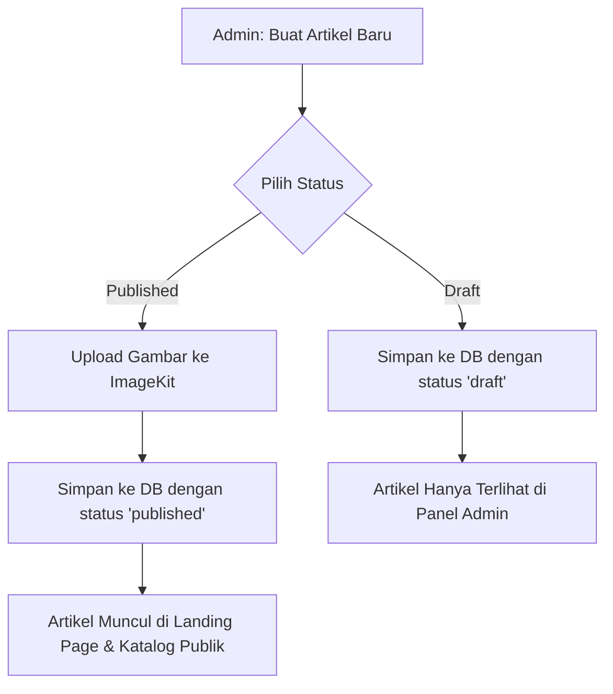
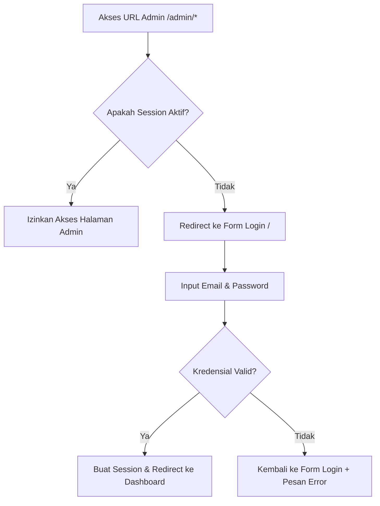

<h1 align="center">
  <br>
  🧠 Psychologia
  <br>
</h1>

<h4 align="center">Portal Artikel & Manajemen Informasi Kesehatan Mental — <em>Edukasi & Kelola Informasi Psikologi</em></h4>

<p align="center">
  
  
  
  
  
  
</p>

<p align="center">
  <a href="#-tentang-aplikasi">Tentang</a> •
  <a href="#-fitur-utama">Fitur</a> •
  <a href="#️-arsitektur-sistem">Arsitektur</a> •
  <a href="#-struktur-database">Database</a> •
  <a href="#-alur-sistem--algoritma">Algoritma</a> •
  <a href="#-stack-teknologi">Teknologi</a> •
  <a href="#-instalasi--setup">Instalasi</a>
</p>

## ℹ️ Tentang Aplikasi

**Psychologia** adalah sebuah aplikasi web portal edukatif berbasis Laravel yang berfokus pada publikasi informasi di bidang psikologi dan kesehatan mental. Aplikasi ini dirancang untuk memfasilitasi pembacaan artikel edukatif oleh masyarakat luas, pengelolaan profil organisasi, serta mempermudah administrator dalam memanajemen anggota dan konten artikel secara terintegrasi melalui panel admin yang intuitif.

### Live Website
Demo aplikasi website dapat langsung diakses melalui link di bawah ini:
* **URL**: [https://301-pixel-vault.infinityfreeapp.com/](https://301-pixel-vault.infinityfreeapp.com/)
* **Akun Demo (Admin)**:
  * **Email**: `director1@gmail.com`
  * **Password**: `password`

---

## 🌟 Fitur Utama

- **Portal Artikel Publik (Landing Page)**: Pengunjung (guest) dapat mengakses Beranda, Hubungi Kami, Katalog Artikel, dan membaca Detail Artikel tanpa perlu mendaftar/login.
- **Sistem Autentikasi**: Fitur login aman bagi administrator dengan sistem proteksi rute berbasis middleware.
- **Dashboard Admin**: Panel kontrol terpusat untuk memantau ringkasan statistik sistem serta mengakses Pusat Bantuan (Help Center).
- **Manajemen Anggota (CRUD)**: Kontrol penuh bagi administrator untuk mengelola data anggota organisasi (tambah, lihat, sunting profil, hapus).
- **Manajemen Artikel (CRUD)**: Memungkinkan admin mengelola konten artikel (tambah dengan editor WYSIWYG TinyMCE, atur status draft/published, pin artikel, kategori, tags, serta hapus).
- **Manajemen Profil & Visi Misi**: Memungkinkan pembaruan data profil admin serta pembaruan data Visi & Misi organisasi secara dinamis.

---

## 🏗️ Arsitektur Sistem

Psychologia dibangun menggunakan pola arsitektur **MVC (Model-View-Controller)** yang merupakan standar dari framework Laravel.



### Sistem Middleware & Proteksi Rute
Aplikasi ini secara ketat memisahkan hak akses menggunakan sistem proteksi rute (Route Protection) dengan Middleware bawaan Laravel:
- **`guest` Middleware**: Diterapkan pada rute autentikasi (`/`, `/login`). Memastikan bahwa hanya pengguna yang belum login yang dapat melihat form login.
- **`auth` Middleware**: Diterapkan pada seluruh rute manajerial (grup rute `/admin/*` dan `/logout`). Memastikan bahwa halaman Dashboard Admin, Manajemen Anggota, dan Manajemen Artikel hanya dapat diakses oleh administrator yang sah. Akses ilegal akan otomatis dialihkan kembali ke form login.
- **Public Routes**: Rute landing page (grup `/landing/*`) dibiarkan terbuka (tanpa middleware pembatasan) agar edukasi psikologi dapat dijangkau oleh khalayak umum.

---

## 📊 Struktur Database

Aplikasi menggunakan database relasional dengan tabel-tabel utama sebagai berikut:



### Deskripsi Tabel
1. **`users`**: Menyimpan data administrator yang mengelola sistem.
2. **`members`**: Menyimpan data anggota organisasi/psikolog yang ditampilkan di profil/organisasi.
3. **`positions`**: Master data untuk jabatan anggota/admin (misal: "Director", "Developer", "Psychologist").
4. **`articles`**: Menyimpan data artikel psikologi dan kesehatan mental.
5. **`article_categories`**: Menyimpan kategori artikel (misal: "Mental Health", "Relationship").
6. **`vision_missions`**: Menyimpan data Visi & Misi organisasi.
7. **`faqs`**: Pusat data FAQ untuk memandu pengunjung dan admin.

---

## 🔄 Alur Sistem & Algoritma

### 1. Alur Publikasi Artikel
Proses di mana administrator membuat, mengunggah media, dan mempublikasikan artikel kesehatan mental ke portal publik.



### 2. Alur Autentikasi & Proteksi Middleware
Menjamin bahwa halaman manajerial terlindungi dan hanya bisa diakses oleh admin setelah proses verifikasi kredensial berhasil.



---

## 🛠️ Stack Teknologi

- **Backend Framework**: [Laravel 12.0](https://laravel.com/) (PHP ^8.2) — Mengelola routing, controller, ORM database, middleware, dan keamanan sistem.
- **Frontend & Styling**: Blade Templates & [Tailwind CSS v4](https://tailwindcss.com/) — Digunakan untuk antarmuka pengguna yang responsif dan modern dengan utility classes terbaru.
- **Dynamic Component**: [Livewire v4.x](https://livewire.laravel.com/) — Digunakan untuk interaksi UI yang dinamis tanpa full-page reload (misal pada filter pencarian dan load artikel).
- **Bundler & Build Tool**: [Vite v7.x](https://vite.dev/) — Untuk manajemen aset JavaScript dan CSS agar load-time aplikasi lebih cepat.
- **Database**: [MySQL](https://www.mysql.com/) — Tempat penyimpanan seluruh data relasional aplikasi.
- **Text Editor (WYSIWYG)**: [TinyMCE](https://www.tiny.cloud/) — Digunakan untuk mempermudah penulisan konten artikel dengan formatting kaya (rich text).
- **Asset Storage & CDN**: [ImageKit](https://imagekit.io/) — Digunakan untuk manajemen penyimpanan dan optimasi gambar profil serta thumbnail artikel secara cloud-based.

---

## ⚙️ Instalasi & Setup

Ikuti langkah-langkah di bawah ini untuk menjalankan proyek Psychologia di lingkungan lokal:

### Prasyarat (Prerequisites)
Pastikan Anda sudah menginstal:
* PHP >= 8.2
* Composer
* Node.js & npm
* SQLite / MySQL Database

### Langkah Instalasi
```bash
# 1. Clone repositori ini
git clone https://github.com/username/psychologia.git
cd psychologia

# 2. Jalankan setup otomatis
# Perintah ini akan menginstal dependensi PHP/JS, menyalin .env, generate key, dan menjalankan migrasi database.
composer install
composer run setup
```

### Konfigurasi Environment (`.env`)
Buka file `.env` di root direktori proyek, lalu sesuaikan konfigurasi database dan ImageKit:
```env
# Database Configuration (Contoh menggunakan SQLite)
DB_CONNECTION=sqlite

# ImageKit Configuration (Wajib diisi jika ingin fitur unggah gambar berfungsi)
IMAGEKIT_PUBLIC_KEY=your_public_key
IMAGEKIT_PRIVATE_KEY=your_private_key
IMAGEKIT_URL_ENDPOINT=your_endpoint_url
```

### Menjalankan Server Lokal
Untuk menjalankan server Laravel, queue worker, real-time logging, dan Vite development server secara bersamaan, jalankan perintah berikut:
```bash
composer run dev
```
Aplikasi dapat diakses melalui browser pada alamat [http://127.0.0.1:8000](http://127.0.0.1:8000).

---

## 📄 Lisensi
Proyek ini bersifat open-source dan dilisensikan di bawah [MIT License](https://opensource.org/licenses/MIT). Anda bebas menggunakan, memodifikasi, dan mendistribusikan kode sumber aplikasi ini.
